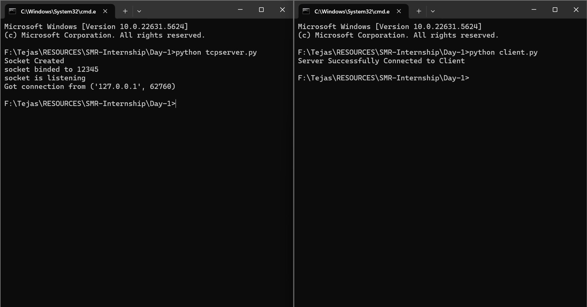
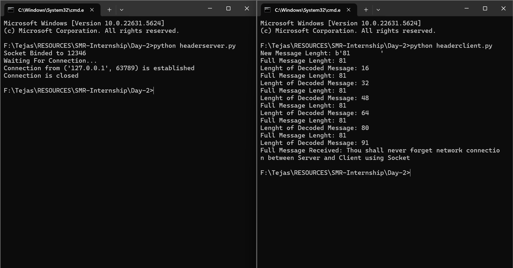

# Internship Daily Log

## Day-1

- Created a server socket with a specific port and encoded data
- Created a client socket and connected it to the port then decoded the data

## Day-2

- Added a header to track the size of data
- Used a fixed buffer to decode the data

## Day-3

- Used pickle to serialize and deserialize data
- Conversion of data between object format and binary format

## Day-4

- Server for console based chat app/room using socket and select
- Server receives chat log for all different clients

## Day-5

- Client for console based chat app/room using socket
- Multiple users can connect and chat simultaneously to each other

## Day-6

- For a common server compared 3 different clients using single processing, multi processing and threading respectively
- Compared time difference of all three clients on a math sum for maximum 10000 iterations
- single processing was slow, multi processing was significantly faster and threading was the fastest

## Day-7 & 8

- Learned about web scraping using BeautifulSoup4 and requests
- Created a program that web scraps country flag images for all countries on a wikipedia page
- The program modifies url of all images as required and saves the images as .svg file at the specified directory

## Day-9 & 10

- Created a program to web scrape images (from pixabay.com) on a specific topic that is taken as input from the user
- Used selenium with chrome web driver, BeatifulSoup4 and requests
- The program also takes input for number of pages to be downloaded at the specified directory

## Day-11 & 12

- Created a program that web scrapes 100 images on a topic that is taken as input from the user
- It then creates 100 folders and stores 100 copies of each image in the respective folder
- A slideshow video is then created for all images in each folder with 1 frame per second i.e. an mp4 file of length 1:40
- The above processes take combined time of 5 minutes on average to complete with single processing

## Day-13 & 14

- Created a program that web scrapes 1000 images on "nature"
- It then creates 1000 folders and stores 1000 copies of each image in the respective folder
- A slideshow video is then created for all images in each folder with 1 frame per second i.e. an mp4 file of length 16:40 
- The above processes take combined time of 27 minutes on average to complete with mutlithreading on all of them

## Day-15 & 16

- Combined scraper_threading.py and executable_threading.py into one file with only one ThreadPoolExecutor/ProcessPoolExecutor
- Used an Object Oriented approach with 2 classes namely ImageTask and ImageScrape that contain many attributes and objects 
- Implemented ThreadPoolExecutor with max_workers=200 and ProcessPoolExecutor with 12 logical processors 
- Above significantly improves time efficiency with the script taking "<8mins" for ThreadPool and "<7mins" for ProcessPool on average
- Also made a UML class diagram for the classes: ImageTask and ImageScrape
- Also added screenshots (from task manager) of system load (CPU, GPU, RAM) when both scripts are executed

